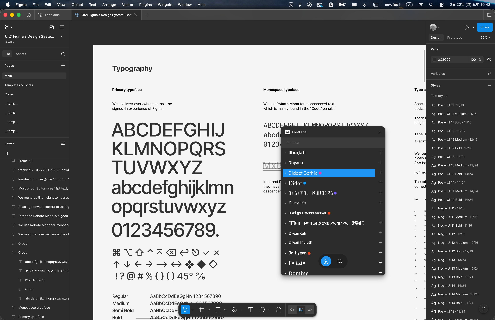
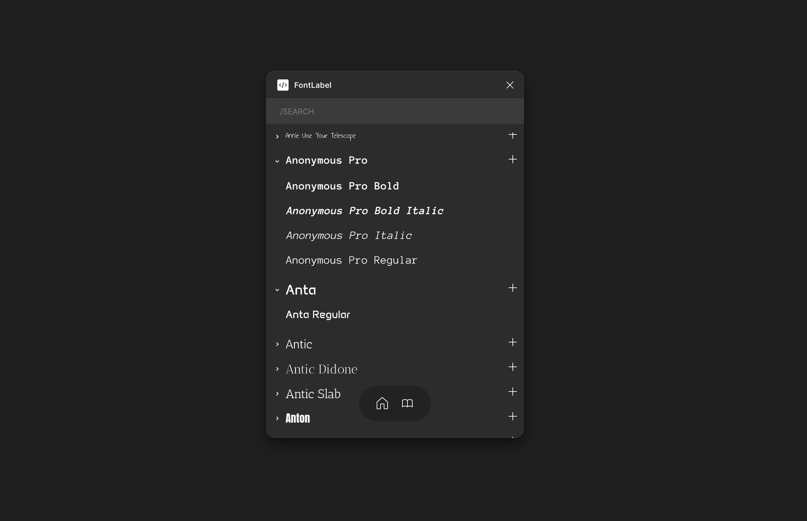
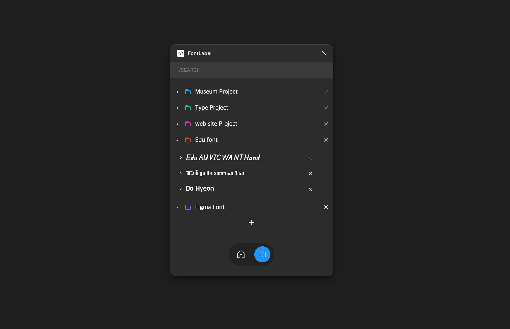
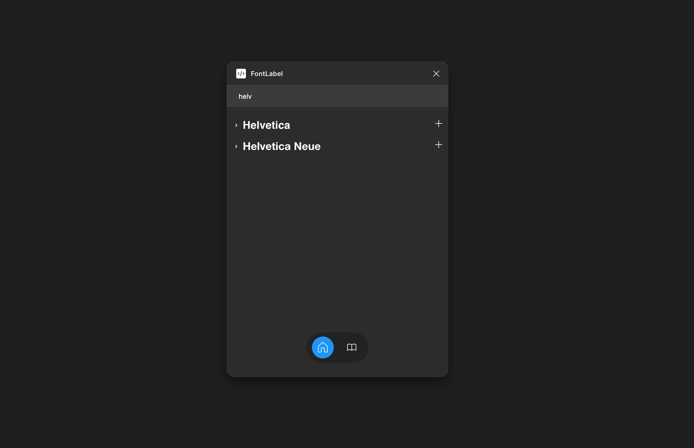

# FontLabel

Figma의 폰트 검색 기능을 개선하는 플러그인.
시스템에 설치된 폰트를 실제 서체로 미리보기하고, 라벨링으로 분류하여 관리할 수 있습니다.



<br>

## 주요 기능

### 1. 서체 미리보기

- Figma API로 SVG를 렌더링하여 폰트 패밀리와 개별 스타일(Bold, Italic 등)까지 실제 글꼴로 표시



### 2. 폰트 라벨링

- 색상과 이름을 지정하여 폰트를 그룹으로 저장 및 관리
- 라벨 간 폰트 이동, 중복 추가 가능



### 3. 검색 기능

- 폰트명으로 빠르게 필터링
- 라벨명으로 그룹 검색



## 기술 스택

**Preact** | **TypeScript**

<br>

## 프로덕트 구조

```
main.ts (Figma Sandbox)
├─ 폰트 목록 조회 (listAvailableFontsAsync)
├─ SVG 프리뷰 렌더링 (TextNode → exportAsync)
└─ 라벨 데이터 영속화 (clientStorage)

ui.tsx (iframe UI)
├─ 상태 관리 (fonts, labels, tab)
├─ pub/sub 프리뷰 시스템 (previewsRef + listenersRef)
└─ 메시지 통신 (postMessage)

VirtualList
├─ padding 기반 가상 스크롤 (~3,000개 → ~20개만 마운트)
└─ 스크롤 위치 캐싱

FolderItem / FontCard
├─ 개별 프리뷰 구독 (subscribePreview)
├─ Intersection Observer 기반 lazy loading
└─ details 태그 lazy rendering
```

<br>

## 트러블 슈팅

### 1. useRef + pub/sub 패턴으로 리렌더링 최적화

- **문제**: 프리뷰 1건 도착 시 부모 `useState` 변경으로 ~3,000개 자식 전체 리렌더링
- **해결**: `useRef`로 캐시 관리, `listenersRef`로 구독자 관리 → 해당 컴포넌트만 리렌더
- **결과**: 렌더링 시간 평균 80ms → 20ms (75% 개선)

### 2. padding 기반 가상 리스트 직접 구현

- **문제**: ~3,000개 폰트가 한 번에 DOM 마운트 → 초기 로딩 539ms
- **해결**: `scrollTop` 기반 인덱스 계산 + `paddingTop`/`paddingBottom`으로 빈 공간 채움
- **결과**: 마운트 컴포넌트 수 ~3,000개 → ~20개, 초기 로딩 대폭 감소

### 3. LIFO 큐로 프리뷰 렌더링 우선순위 개선

- **문제**: FIFO 큐에서 이미 화면에 없는 폰트 프리뷰를 먼저 처리
- **해결**: `splice(-BATCH_SIZE)`로 최근 요청(현재 화면) 우선 처리
- **결과**: 프리뷰 대기 시간 FIFO ~35,000ms → LIFO ~560ms
